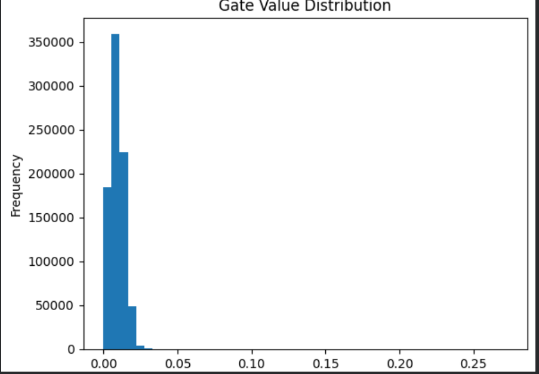

# self_pruning_neural_network_Saniya_Jindal_102303183
self_pruning_neural_network
# Self-Pruning Neural Network

## Overview

This project implements a self-pruning neural network where each weight is controlled by a learnable gate. The network learns to remove unnecessary connections during training using sparsity regularization.

---

## Key Idea

Each weight is multiplied by a gate:

Effective Weight = Weight × Sigmoid(Gate Score)

* Gate ≈ 1 → active
* Gate ≈ 0 → pruned

---

## Architecture

* Custom PrunableLinear layer
* Fully connected neural network
* CIFAR-10 dataset

---

## Loss Function

Total Loss = Classification Loss + λ × Sparsity Loss

---

## Results

| Lambda | Accuracy | Sparsity |
| ------ | -------- | -------- |
| 0.01   | 30.09%   | 95.78%   |
| 0.1    | 30.43%   | 99.98%   |
| 0.5    | 25.52%   | 100.00%  |

---

## Observations

* Increasing λ significantly improves sparsity.
* At λ = 0.5, the model achieves complete pruning (100% sparsity).
* Higher sparsity leads to a drop in accuracy, demonstrating the trade-off between model compression and performance.
* λ = 0.1 provides a good balance between accuracy and sparsity.

---

## Gate Distribution

The histogram shows a strong concentration of gate values near zero, indicating successful pruning.

---

## How to Run

pip install torch torchvision matplotlib
Run the notebook in Google Colab

---

## Conclusion

This project demonstrates a self-pruning neural network that dynamically removes unnecessary connections during training using learnable gates and L1 regularization.
