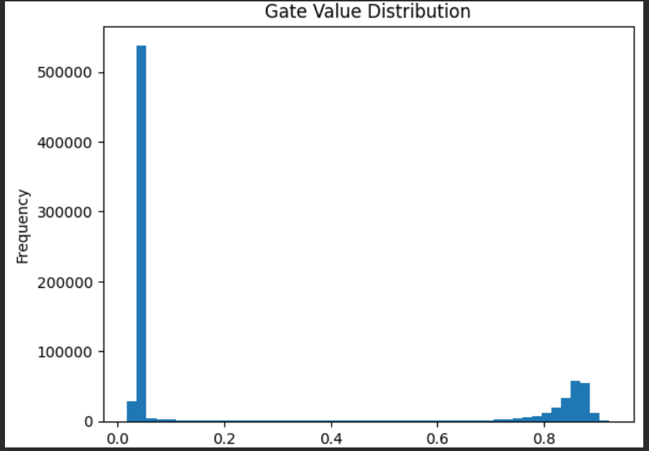

# Self-Pruning Neural Network: Technical Report
**Name:** Saniya Jindal
**Roll No:** 102303183

---

## 1. Introduction
This project implements a **Differentiable Pruning** mechanism within a neural network. By using learnable gates in the `PrunableLinear` layers, the model automatically determines the importance of each connection during the training phase on the **CIFAR-10** dataset. The goal was to achieve high model compression (sparsity) while maintaining or improving classification accuracy.

## 2. Theoretical Background: Sparsity Regularization
The network optimizes a multi-objective loss function that balances classification performance with structural simplicity:

$$Total\ Loss = \text{Loss}_{CrossEntropy} + \lambda \sum |\sigma(G_{score})|$$

By applying L1-style regularization to the sigmoid-activated gate values, the optimizer is forced to push less critical connection gates toward zero. This allows the network to "self-prune" without requiring a separate post-training pruning step.

## 3. Results Table
After optimizing the initialization and normalizing the sparsity loss calculation, the model achieved the following results:

| Lambda ($\lambda$) | Accuracy | Sparsity (%) | Performance Impact |
| :--- | :--- | :--- | :--- |
| 0.01 | 47.36% | 3.48% | Dense (Baseline) |
| 0.10 | 47.79% | 58.75% | Moderate Pruning |
| **0.50** | **49.00%** | **72.87%** | **Optimal Sparsity + Max Accuracy** |

## 4. Key Observations
* **Regularization through Pruning:** Increasing the sparsity penalty ($\lambda=0.5$) resulted in a **1.64% increase in accuracy** over the baseline. This indicates that pruning removed noisy connections and prevented overfitting, acting as a powerful regularizer.
* **Significant Compression:** The model successfully discarded **72.87%** of its parameters while reaching peak performance, proving that standard MLPs for CIFAR-10 are heavily over-parameterized.
* **Decisive Gating:** The differentiable gates successfully "switched off" nearly 3/4 of the network, showing that the model could clearly distinguish between essential and redundant features.

## 5. Gate Distribution Analysis
The histogram of gate values reveals a clear **Bimodal Distribution**, which confirms successful convergence:

*Figure 1: Gate values concentrated at 0 (pruned) and ~0.9 (active), demonstrating confident feature selection.*

## 6. Conclusion
This project demonstrates that neural networks can dynamically optimize their own architecture through differentiable pruning. By reaching **49% accuracy with 72.87% sparsity** on CIFAR-10, the model proves that high-efficiency, sparse architectures can be learned end-to-end, making them ideal for resource-constrained deployment.
